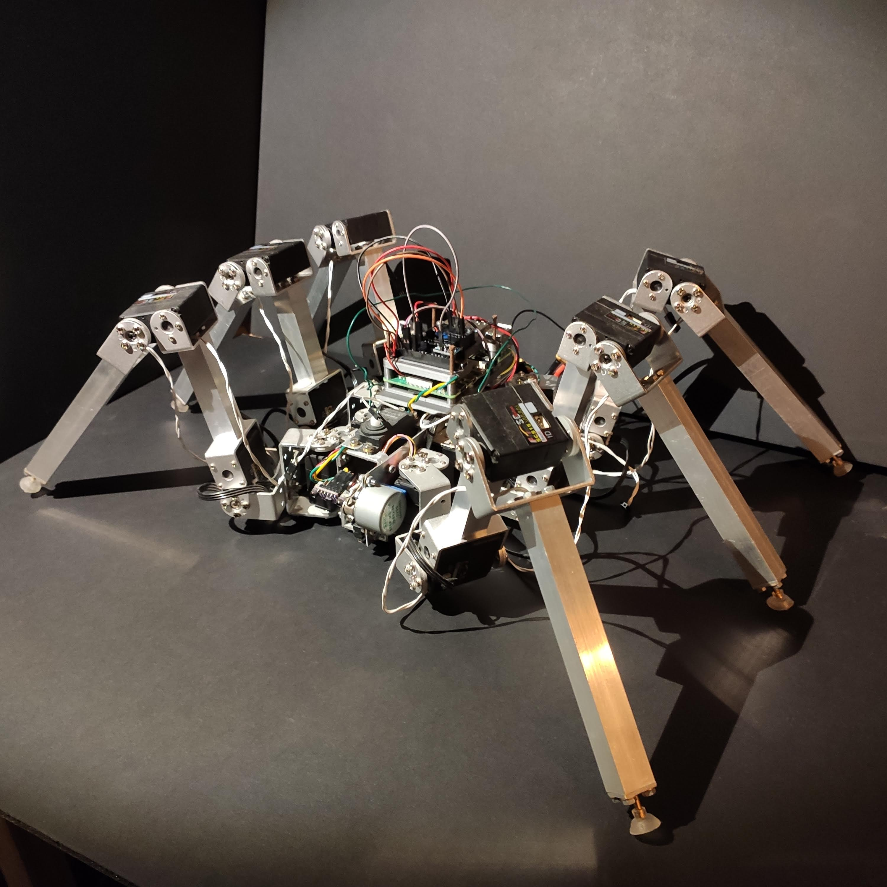
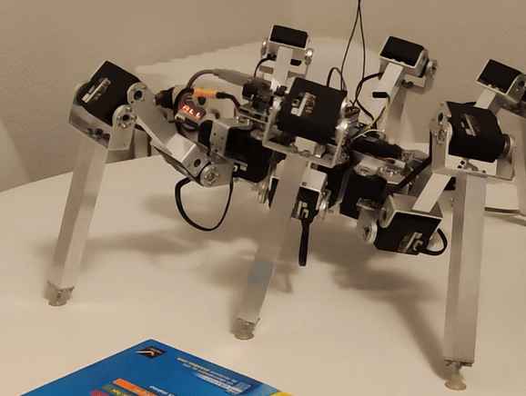

# hexapod-robot

An hexapod robot! This was my first programming project ever. This repo contains the 2nd (cleaner) version of the code.

## Pictures

|The robot|
| -------- |
||

|**Robot tilting, inverse kinematics**|
| -------- |
||

